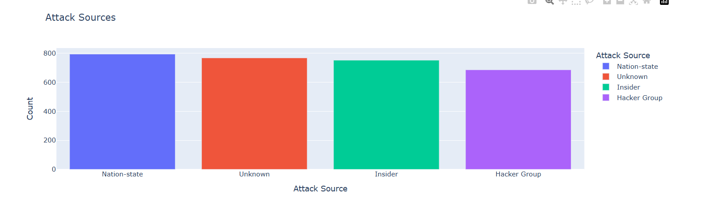
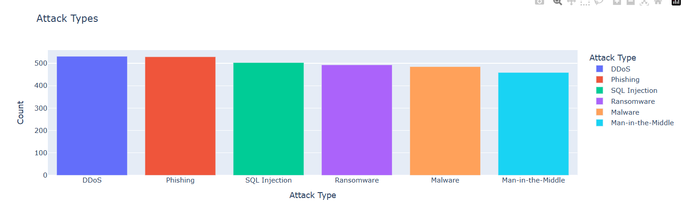
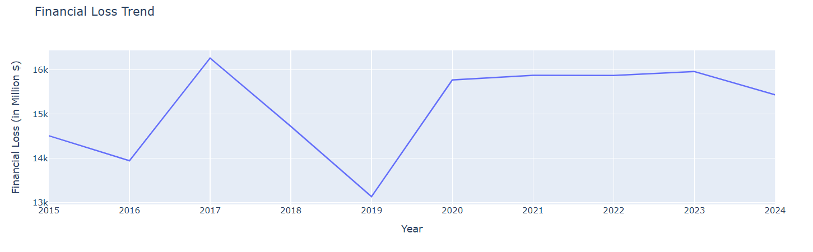
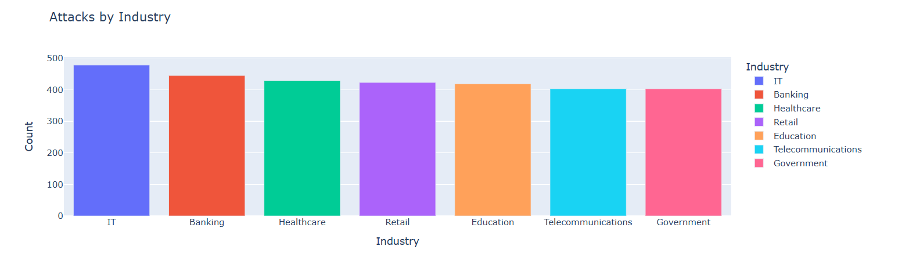
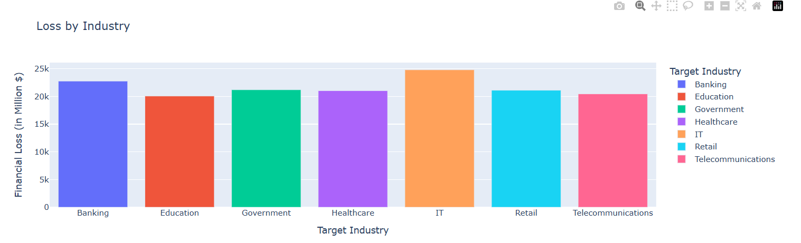
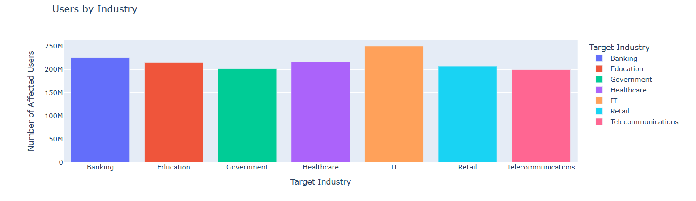
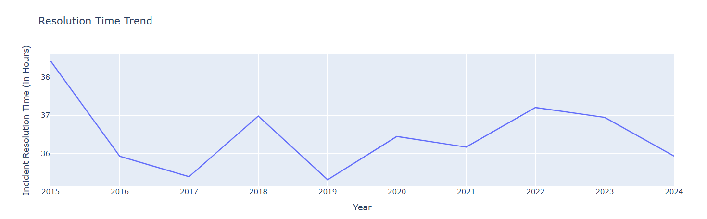
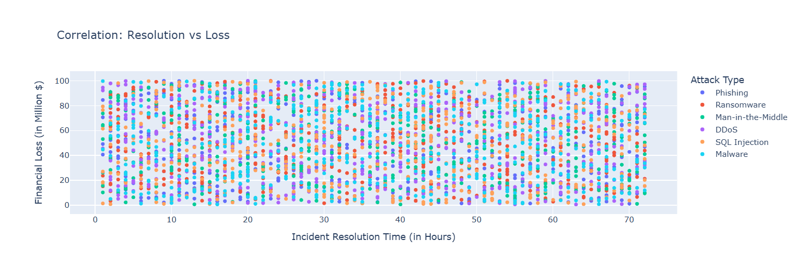

# Global Cybersecurity Threat Analysis (2015–2024)

## Project Overview

This project analyzes global cybersecurity incidents from 2015 to 2024 to understand attack trends, industry risks, financial impacts, security vulnerabilities, and incident response performance. The analysis uses data visualization and dashboard development to transform cybersecurity data into actionable insights that can support better security decision-making.
The project examines attack patterns across different countries and industries, identifies the most common threats, evaluates the effectiveness of defense mechanisms, and highlights areas where organizations can improve their cybersecurity posture. The findings can help businesses reduce risks, protect sensitive information, and improve incident response capabilities.

## Business Problem

Cyberattacks are becoming more frequent and more sophisticated, creating serious challenges for organizations worldwide. Businesses face increasing financial losses, operational disruptions, and risks to customer trust due to cyber threats.

Organizations need to understand:

- Which cyberattacks occur most frequently.
- Which industries face the highest risk.
- What vulnerabilities are commonly exploited.
- Which attack sources cause the greatest damage.
- How effective current security measures are.
- How quickly incidents can be detected and resolved.
By analyzing historical cybersecurity incidents, organizations can identify attack patterns, strengthen weak areas, improve response times, and invest in more effective security technologies.

## Dataset Information

This project uses the Global Cybersecurity Threats (2015–2024) dataset, which contains cybersecurity incident data collected from multiple countries and industries between 2015 and 2024.

The dataset includes information about:

- Attack types
- Target industries
- Financial losses
- Affected users
- Attack sources
- Security vulnerabilities
- Defense mechanisms
- Incident resolution times

## Dataset Details
- Dataset Name: Global Cybersecurity Threats (2015–2024)
- Source: Kaggle
- Records: 3,000 cybersecurity incidents
- Features: 10 variables
- Time Period: 2015–2024
- Format: CSV

### Dataset Credit

Original dataset available on Kaggle and licensed under CC0 (Public Domain), allowing free use for research, analysis, and educational purposes.
Credit should be given to the original dataset creator when sharing derivative work.

Dataset: Global Cybersecurity Threats (2015–2024)
Source: Kaggle
License: CC0 Public Domain

## Project Objectives

The main goal of this project is to analyze global cybersecurity incidents from 2015 to 2024 and generate insights that help organizations improve cybersecurity and reduce risk.

### Objectives
- Analyze the cybersecurity attack landscape and identify common attack types.
- Assess cybersecurity risks across industries.
- Measure financial losses caused by cyberattacks.
- Evaluate the impact of attacks on users.
- Identify the most exploited security vulnerabilities.
- Analyze attack sources such as nation-state actors, hacker groups, and insider threats.
- Evaluate the effectiveness of cybersecurity defense mechanisms.
- Measure incident response performance and resolution times.
- Identify long-term cybersecurity trends between 2015 and 2024.
- Explore relationships between financial loss, user impact, and incident response metrics.

## Tools & Technologies
- pandas
- numpy
- matplotlib
- seaborn
- plotly
- jupyter
- dash

## Project Workflow

- Data Collection
- Data Cleaning
- Exploratory Data Analysis (EDA)
- Data Visualization
- Dashboard Development
- Insight Generation
- Recommendations

## Dashboard Overvirw

The dashboard consists of several key visualizations that highlight global cybersecurity trends:

### Attack Source



### Attack Type



### Financial Loss Trend



### Attacks by Industry



### Loss by Industry


###  Users by Industry


### Resolution Time Trend


### Resolution vs Loss


## Key Findings

- DDoS and Phishing are the most common cyberattacks.
- The IT sector experiences the highest number of attacks.
- Ransomware causes the highest average financial loss.
- Nation-state actors are the most common attack source.
- Zero-day vulnerabilities are the most exploited weakness.
- AI-based detection systems reduce incident resolution times.
- Financial loss, user impact, and resolution time show weak correlations.

## Recommendations

- Improve vulnerability management and patching.
- Implement Multi-Factor Authentication (MFA).
- Invest in AI-based threat detection.
- Strengthen incident response procedures.
- Conduct regular cybersecurity awareness training.

## Project Structure

```text
global-cybersecurity-analysis/
│
├── data/
├── notebook/
├── dashboard/
├── eda/
├── src/
├── report/
└── README.md
├── requirements.txt
```

## Files Included

- `cybersecurity_analyst.ipynb` – Data cleaning, analysis, and visualizations
- `CyberSecurity Analyst.pdf` – Project report
- `Global_Cybersecurity_Threats_2015-2024.csv` – Source dataset
